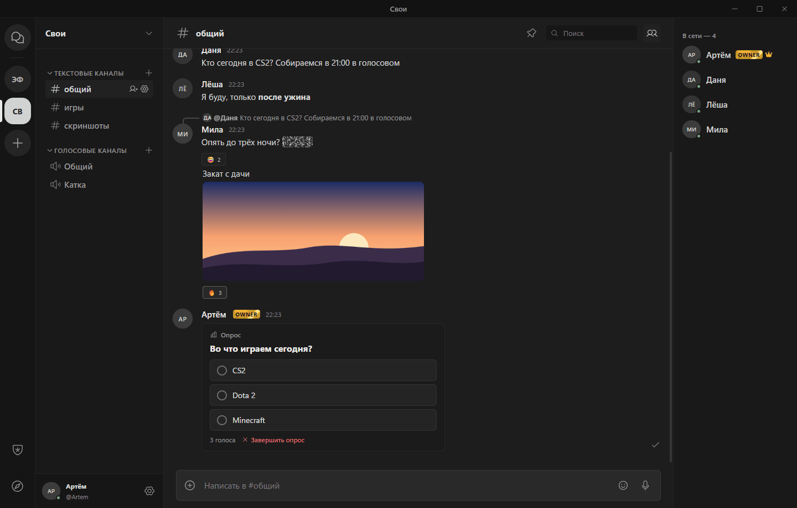
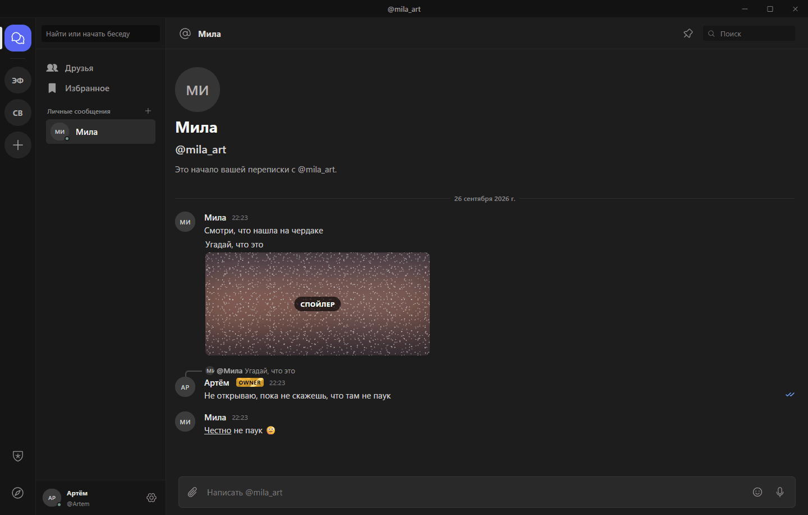

# Эфир

Мессенджер для своей компании: серверы с каналами и ролями, личные сообщения, голос и
демонстрация экрана. Приложение для Windows.

Здесь выходят установщики. Исходный код закрыт; условия использования — в
[LICENSE](LICENSE).

<p>
  
  
</p>

| | |
| --- | --- |
| Последняя версия | [Releases → latest](../../releases/latest) |
| Скачать | `Efir-Setup-<версия>.exe` на странице последнего релиза; Windows 10 и 11, 64 бита |
| Документация | [docs](docs/README.md) · [English](docs/en/README.md) |
| Bot API | [HTTP API](docs/bots/rest.md) · `npm install efir-bot` · `pip install efir-bot` |
| Лицензия | бесплатно, код закрыт — [LICENSE](LICENSE); библиотеки для ботов — MIT |

## Скачать

Последняя версия — на странице [Releases](../../releases/latest): файл
`Efir-Setup-<версия>.exe`.

Требования: Windows 10 или 11, 64 бита.

## Установка

1. Запустите `Efir-Setup-<версия>.exe`. Эфир установится для текущего пользователя, права
   администратора не нужны, и сразу откроется.
2. Установщик не подписан сертификатом, поэтому Windows может показать окно «Windows
   защитила ваш компьютер». Нажмите «Подробнее», затем «Выполнить в любом случае».
3. Ярлык «Эфир» появится на рабочем столе и в меню «Пуск».

Проверить, что файл не изменён, можно по контрольной сумме из описания релиза:

```
certutil -hashfile Efir-Setup-<версия>.exe SHA256
```

## Подключение

Приложение подключается к серверу, адрес которого встроен в сборку. Сервер доступен в
сети Radmin VPN: установите [Radmin VPN](https://www.radmin-vpn.com/ru/) и подключитесь к
сети, название и пароль которой вам даст владелец сервера. После этого зарегистрируйтесь в
Эфире.

## Обновления

Установленный Эфир сам проверяет новые версии при запуске и раз в 6 часов, скачивает
обновление, проверяет подпись разработчика и контрольную сумму и после вашего согласия
устанавливает. Скачивать новые версии вручную не нужно. Журнал обновлений и откат на
прошлую версию — в настройках, раздел «Обновления».

## Возможности

- Серверы, категории, текстовые и голосовые каналы, роли и права.
- Личные сообщения, друзья, статусы, «Избранное».
- Разметка, ответы, правка, закрепы, реакции, вложения, пересылка.
- Голосовые сообщения и кружочки, события и опросы.
- Голос с шумоподавлением и демонстрация экрана со звуком.
- Непрочитанные, прочтение, уведомления Windows.
- Оверлей в играх и горячие клавиши.
- Боты.

## Для разработчиков

Ботов можно писать на любом языке через Bot API; для Node.js и Python есть библиотеки:
`npm install efir-bot`, `pip install efir-bot`. Документация, правила и примеры — в
[docs](docs/README.md). Developer documentation in English: [docs/en](docs/en/README.md).

## Лицензия

Бесплатное программное обеспечение с закрытым исходным кодом. Можно пользоваться и
передавать неизменённый установщик другим бесплатно. Полный текст — в [LICENSE](LICENSE).
